<h1>
 SWI 
</h1>

<h1>
 Laboratoire 3 WPA - Entreprise 
</h1>

<h2>
 Nuno Miguel Cerca Abrantes Silva, Elie N'djoli 
</h2>

### Partie 1

Dans cette première partie on va passer en revue les trames reçu lors d'une authentification EAP-TLS.

Voici l'ensemble des trames:

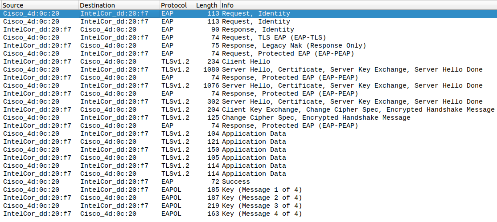

#### Phase d’initiation. Identité du client

Les premières trames d'authentification capturées contiennent les identifiant de l'authentificateur et du suppliant.

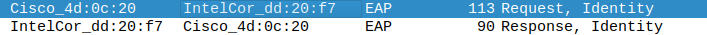

La trame Request identity envoyé par authentificateur contient les données lié à l'AP :

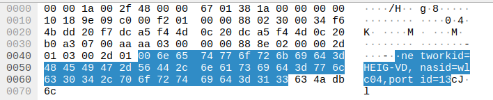

La trame de réponse contient l'identité du suppliant :

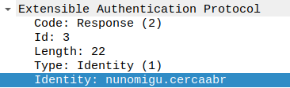

#### Phase hello

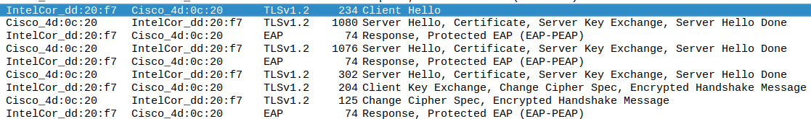

- Version TLS

On retrouve dans la trame Cient Hello le numéro de version du protocol TLS

- Sélection de la méthode d’authentification

  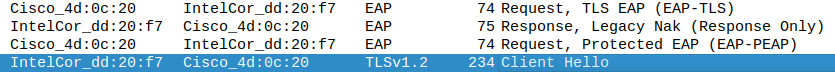

- Liste des cipher proposées par le client (trame Client Hello)

- Cipher accepté par l’AP (trame server Hello)

  

- Nonces

  La valeur Random ci-dessous représente le Nonce

  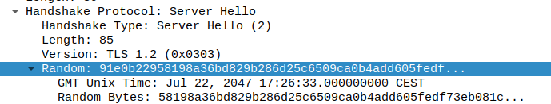

- Session ID (trame Server Hello)  (les Session ID du client Hello est vide)

  

#### Phase de transmission de certificats

Certificat serveur (Trame server Hello)

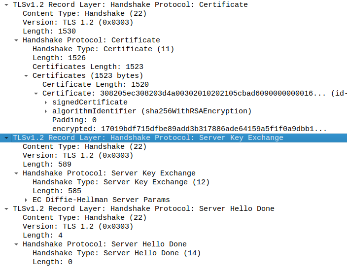

- Change cipher spec

  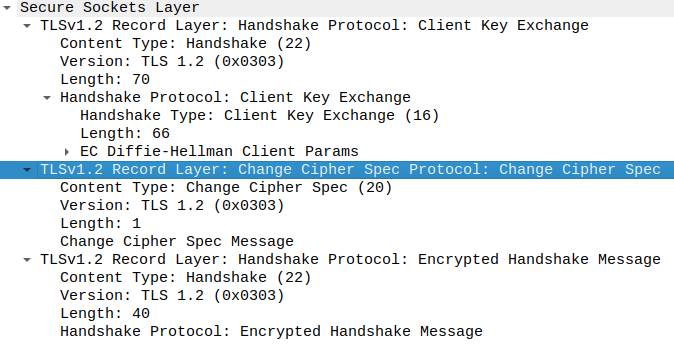

#### Authentification interne et transmission de la clé WPA (échange chiffré, vu comme « Application data »)

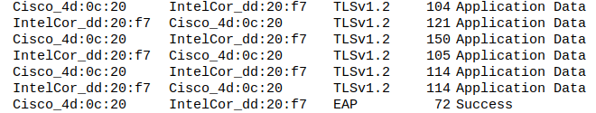

#### 4-way handshake

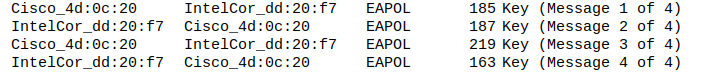

### Partie 2

##### Modification du fichier hostapd-wpe.conf

Le fichier hostpad-wpe.conf à été mis à jour afin qu'un AP nommée WinternetIsComing soit créé.

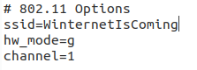

De plus, il a été nécessaire d'adapter le nom de l'interface

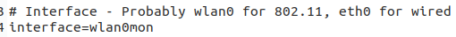

##### Lancement de hostpad-wpe

Après la mise à jour du fichier hostapd-wpe.conf on a pu lancer lancer l'AP avec la commande `sudo hostapd-wpe hostapd-wpe.conf`. Après un temps d'attente l'utilisateur "Elie" à tenté de se connecter à l'AP

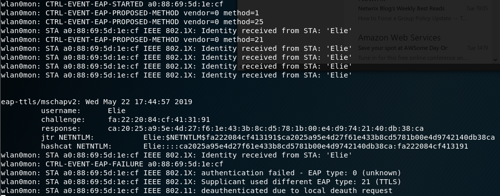

On a pu récupéré son challenge et sa response pour récupérer son mot de passe avec l'outil asleap et avons trouvé son mot de passe qui est "hello"

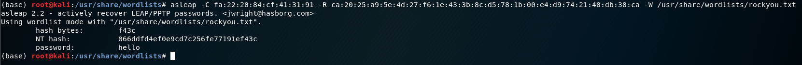

Il est aussi possible d'utiliser john de ripper pour effectuer cette étape. Pour cela, il faut mettre le "jrt NETNLM" récupéré avec hostapd-wpe dans un fichier texte et de lancer la commande suivante `john --format=netntlm fichier_texte.txt` 

#### Méthode d'autentification géré par hostapd-wpe

Les méthode d'authentification ci-dessous sont géré par hostpad-wpe:

1. EAP-FAST/MSCHAPv2 (Phase 0)
2. PEAP/MSCHAPv2
3. EAP-TTLS/MSCHAPv2
4. EAP-TTLS/MSCHAP
5. EAP-TTLS/CHAP
6. EAP-TTLS/PAP

##### Source

<https://warroom.rsmus.com/evil-twin-attack-using-hostapd-wpe/>