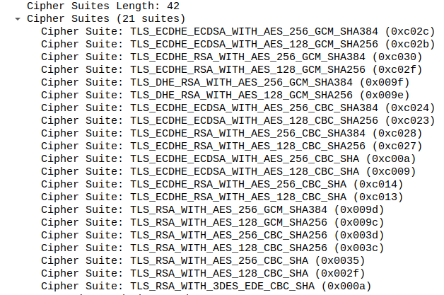
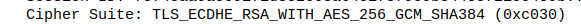

<h1>
 SWI 
</h1>

<h1>
 Laboratoire 3 WPA - Entreprise 
</h1>

<h2>
 Nuno Miguel Cerca Abrantes Silva, Elie N'djoli 
</h2>

### Partie 1

Dans cette première partie on va passer en revue les trames reçu lors d'une authentification EAP-TLS.

Voici l'ensemble des trames:

#### Phase d’initiation. Identité du client

Les premières trames d'authentification capturées contiennent les identifiant de l'authentificateur et du suppliant.

La trame Request identity envoyé par authentificateur contient les données lié à l'AP :

La trame de réponse contient l'identité du suppliant :

#### Phase hello

- Version TLS

On retrouve dans la trame Cient Hello le numéro de version du protocol TLS

- Sélection de la méthode d’authentification

  

- Liste des cipher proposées par le client (trame Client Hello)

- Cipher accepté par l’AP (trame server Hello)

  

- Nonces

  La valeur Random ci-dessous représente le Nonce

  

- Session ID (trame Server Hello)  (les Session ID du client Hello est vide)

  

#### Phase de transmission de certificats

Certificat serveur (Trame server Hello)

- Change cipher spec

  

#### Authentification interne et transmission de la clé WPA (échange chiffré, vu comme « Application data »)

#### 4-way handshake

